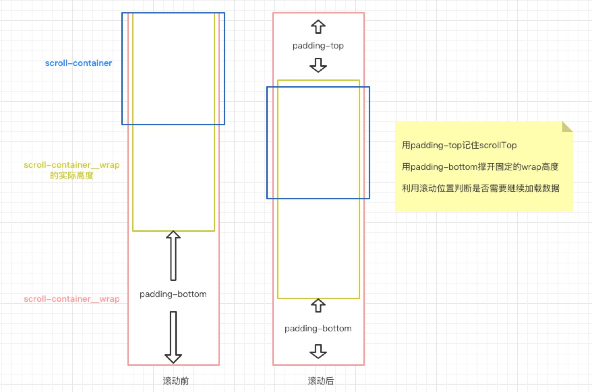
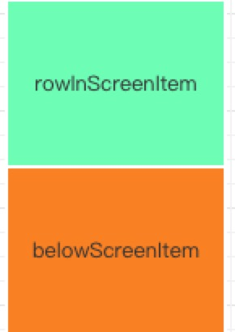
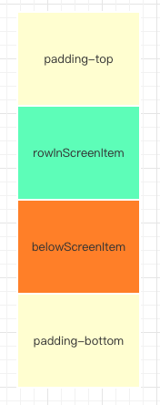

# infinite-scrolling
Vue列表无限滚动的解决方案，[demo请戳](http://iming.work:81/#/)，[源码请戳](https://github.com/Jmingzi/infinite-scrolling/blob/master/src/components/InfiniteScrolling.vue)

> 思路原理借鉴 [Vue.js 一个超长列表无限滚动加载的解决方案](https://juejin.im/entry/5819993fbf22ec0068aab054)

### 解决的问题

保持列表中显示的数据条数永远固定在一个值，例如本例子中，固定的条数为滚动容器内可以显示的条目的2倍，因为是2个区域。

当下拉或滑动时，即时加载了1w条数据，容器内显示的永远只有例如14条。

### 原理

这个组件的`template`看起来是这样的：
```html
  <div class="scroll-container">
    <div class="scroll-container__wrap">
      <div class="scroll-container__item">...</div>
      <div class="scroll-container__item">...</div>
      <div class="scroll-container__item">...</div>
      ...
      <div class="scroll-container__item">...</div>
    </div>
  </div>
```

首先需要确立几个固定的要素

- 可滚动容器`scroll-container`高度固定，并且`overflow: auto`
- 每一条目`scroll-container__item`的高度固定，比如70、150等等
- 条目的父元素`scroll-container__wrap`其实高度也是固定的，它的总高度为`总条目数*条目高度`，它的高度不是直接设定的，而是通过上下`padding`撑开。

为什么要这么做呢？方法有很多种，其实这只是其中的以一种实现方案，只需要理解：**当总条目数量一定时，那么条目包裹容器`scroll-container__wrap`的总高度肯定也是一定的，因为必须确保在切割显示数组之后，`scrollTop`位置不变，而这个保持不变的方法是通过padding实现**



我们说的2个区域是什么呢？为什么要用2个？



在滚动容器内，能够平铺可见的区域为`rowInScreenItem`，我们还需要在下方放置一样大小的`belowScreenItem`用来滚动显示，而不至于是空白

其实准确的来讲，还应该存在padding区域



### 数据分页

当滚动的距离差大于当前滚动容器的高度时，需要更新切割数据
```
Math.abs(scrollTop - this.lastScrollTop) > this.screenItemHeight
```

那何时去拉数据呢？

```
if (this.toIndex >= this.dataList.length) {
  // 重新拉取新数据
}
```

当分割终点的索引大于等于总数据条数时，说明总数据源不够切割了。


### 总结

如何更清晰的理解这个逻辑，我们不妨忘掉前面所讲的，仔细思考一下我们平常在列表渲染时的做法：

- 初始时，获取数据，显示在容器中
- 当滚动到底的时候，再去拉数据填充

每拉一次数据，总数据的数量就被增大了，条目的父元素的高度也就被撑开了，实际滚动容器内一屏所显示的数量也是固定的

和上述方案所说的内容差不多，只不过撑开高度用padding，用一个数组存放当前显示的数据条目，用2个索引记录了当前切割显示的数据位置。

### 待完善

- [ ] 滚动节流
- [ ] ~~~移动端添加touchmove事件~~~

### 使用说明

```
npm install xm-mui -S
```

```js
// 依赖babel-plugin-component按需引入
import { InfiniteScroll } from 'xm-mui'

export default {
  components: {
    InfiniteScroll
  }
}
```

```html
<infinite-scroll
  :fn-fetch="fetch"
  :item-height="70"
  :loading="loading"
>
  <!--scope slot-->
  <span slot-scope="{ row }">
    {{ row.name }}
  </span>
</infinite-scroll>
```
fn-fetch是Promise拉取数据的接口，关于currentPage是由自己控制的，loading为请求的状态。

